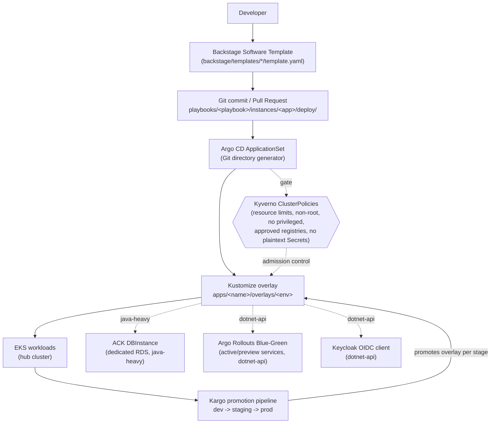

# Application Modernization Factory

This is a demo/spike repository simulating a "platform engineering factory"
for application modernization: instead of every team hand-rolling its own
Terraform, Kubernetes manifests, secrets wiring, progressive-delivery
config, and observability hooks, they self-service a standardized,
pre-approved **playbook** through a **Backstage** developer portal. A
playbook is a self-contained, parameterized template — Dockerfile,
Kustomize base/overlays, and any infra-adjacent resources (an ACK-managed
RDS database, a Keycloak OIDC client, an Argo Rollouts blue-green rollout)
— that gets stamped out with real values and committed to this repo. From
that commit onward, GitOps takes over: Argo CD, Kyverno, and Kargo do the
rest, with no manual `kubectl` or `aws` CLI involved.

This repository was built as a demo/spike by three parallel agents working
concurrently on `/infra`, `/platform-engine`, and the `/playbooks`
skeletons, with `/backstage` (this layer) wiring them together into a
single self-service flow.

## Architecture



## Repo structure

| Path | What lives there |
| --- | --- |
| `/infra` | Terraform that bootstraps the hub EKS cluster: VPC, EKS control plane + managed node group, and IRSA roles for the EBS CSI driver and the ACK RDS controller. |
| `/platform-engine` | Argo CD ApplicationSets (Git generator watching `playbooks/*/instances/*`), Kargo projects/warehouses for dev->staging->prod promotion, and Kyverno ClusterPolicies enforcing baseline security and secrets-handling rules. |
| `/playbooks/java-heavy` | Skeleton for modernizing a Java monolith: multi-stage Dockerfile, ExternalSecret + SecretStore, and an ACK `DBInstance`/`DBSubnetGroup` for a dedicated RDS database. |
| `/playbooks/dotnet-api` | Skeleton for modernizing a legacy .NET API: multi-stage Dockerfile, Argo Rollouts blue-green manifests, and a Keycloak OIDC client registration. |
| `/backstage` | The Backstage Software Templates and catalog entities that turn the two playbooks above into a self-service "fill in a form, get a PR" experience — the only supported trigger into the factory. |

## Guardrails

- **Playbook encapsulation.** Each playbook under `/playbooks/<name>` is
  self-contained: its skeleton carries everything a scaffolded instance
  needs (Dockerfile, manifests, secrets wiring). Playbooks don't reach into
  each other, and the platform engine treats every `playbooks/*/instances/*`
  directory identically regardless of which playbook produced it.
- **No manual intervention.** Once `/infra` and `/platform-engine` are
  bootstrapped, every subsequent app onboarding flows from a single
  Backstage submission to an Argo CD sync. There is no supported path that
  involves a developer running `kubectl apply`, `aws rds create-db-instance`,
  `argocd app create`, or editing a Keycloak realm by hand — if a step
  can't be done through Backstage, it belongs in a playbook, not a terminal.

## Getting started

1. **Bootstrap the hub cluster.**
   ```bash
   cd infra
   terraform init
   terraform apply
   ```
2. **Install the platform engine.** Apply the App-of-Apps root once, by
   hand, to bring in Argo CD's ApplicationSet, Kyverno's ClusterPolicies,
   and the Kargo project:
   ```bash
   kubectl apply -f platform-engine/argocd/applications/root-app.yaml
   ```
   This is the last manual `kubectl` command in the whole flow.
3. **Run Backstage locally** (see `backstage/README.md` for full setup) and
   point its software-templates location at `backstage/templates/*/template.yaml`.
4. **Scaffold a new app.** From Backstage's Create page, pick
   `java-heavy-monolith` or `dotnet-legacy-api`, fill in the parameters
   (app name, namespace, environments, and the playbook-specific fields),
   and submit.
5. **Merge the pull request** the scaffolder opens against this repo.
6. **Watch Argo CD sync automatically.** The `playbook-instances`
   ApplicationSet picks up the new `playbooks/<playbook>/instances/<app>/deploy`
   directory on its next poll, Kyverno validates the manifests at
   admission time, and Kargo begins promoting the workload from `dev`
   through `staging` to `prod`.
